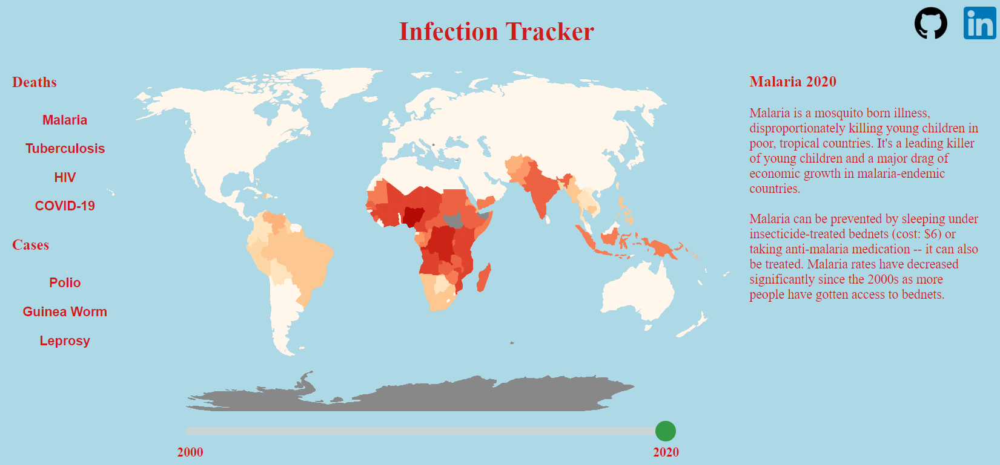
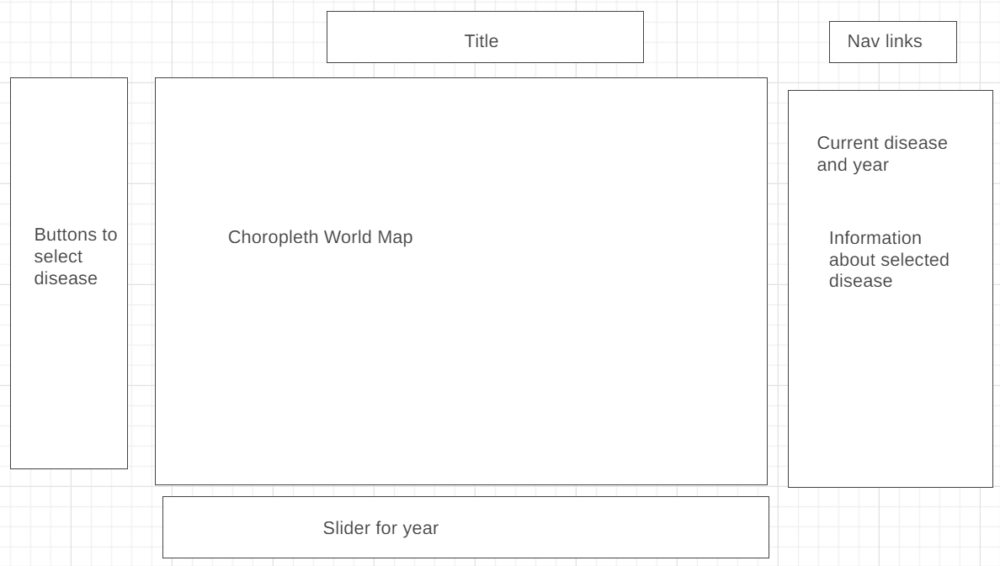
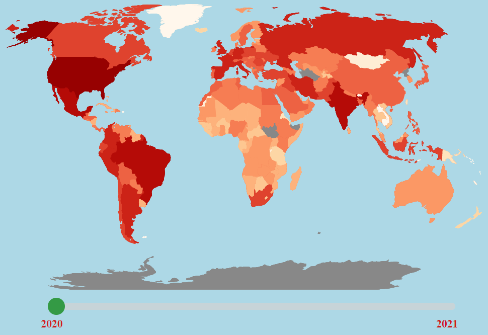
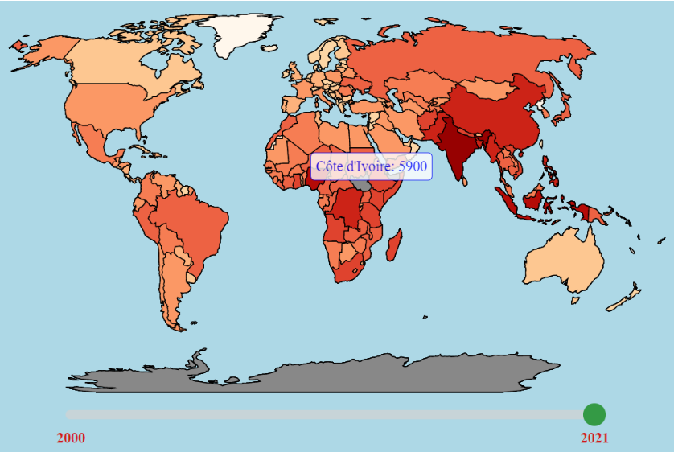
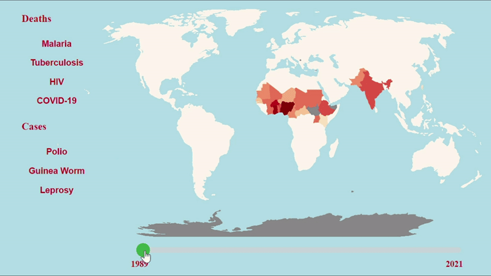

# JavaScript Project: Disease Tracker

Disease tracker is a data visualization showing deaths and infections from infectious diseases worldwide.  It shows COVID-19 and the "Big Three" infectious diseases in global health (malaria, tuberculosis, and HIV), as well as certain neglected tropical diseases (polio, guinea worm, and leprosy).  For COVID-19 and the big three (which kill large numbers of people every year), it shows the number of deaths; for the neglected tropical diseases (which rarely kill people and are targeted for eradication), it shows the number of cases.  All maps are shown using the same color scale to allow better comparisons between the burden of different diseases.



## Wireframe:



## With Disease Tracker, users can:

- #### See the number of deaths/infections for a given disease for countries around the world



These map uses a log scale, with every darkening of one shade representing a roughly 3x increase in number.  Borders are not explicitly to show a greater focus on regions over specific countries.

- #### Hover over a specific country to see its name and number of deaths/infections



This program uses a tooltip element that's transparent most of the time but appears with text when hovering over an element.  The mouseover function also adds borders to every country to focus more on country-level differences.  Note that the popup box allows special characters.


```
    let mouseOver = function(d) {
      d3.selectAll(".Country")
        .transition()
        .duration(400)
        .style("stroke", "black")
      
      tooltip
      .style("opacity", 0.8)
      .html(d.total == -1 ? "No data" : conversionHash[d.id] + ": " + d.total)
      .style("left", (d3.event.pageX + 30) + "px")  
      .style("top", (d3.event.pageY - 30) + "px");
    }
  
    let mouseLeave = function(d) {
      d3.selectAll(".Country")
        .transition()
        .style("stroke", "transparent")
        
      tooltip
        .style("opacity", 0)
    }
    ```

- #### Use the slider to see how disease burden has changed over time



Comparing maps one-by-one shows changes, but using a slider gives a much better sense in how the fight against guinea worm has evolved over time.

When changing between maps originally, the map would disappear and then reappeared as it was recolored.  This program solves that by having multiple maps in the background.  Having three maps prevent flashing and doesn't cause lagging, so whenever the user changes diseases, this program creates three copies of the new disease map, thus allowing them to use the slider without the map flashing.
```
class Button {
    constructor(ele,map,disease){
        this.ele = ele;
        this.map = map;
        this.disease = disease;
        this.ele.addEventListener("click", this.handleClick.bind(this));
    }

    handleClick(){
        this.map.resetMap(this.disease,this.map.year);
        this.map.resetMap(this.disease,this.map.year);
        this.map.resetMap(this.disease,this.map.year);
        const html = svg._groups[0][0].innerHTML.split('<g>')
        const len = html.length
        svg._groups[0][0].innerHTML = [html[len-3],html[len-2],html[len-1]].join('<g>')
    }
}

export default Button;
```

### This project also includes:
- Data stored in CSV files
- A production README

## Technologies and libraries used:
- This document uses the Data-Driven Documents (D3) JavaScript library to create choropleth maps
- Webpack to bundle code from different files together
- npm to manage different modules

## Implementation Timeline:
- Thursday: find data sources and technologies to use
- Friday & weekend: download and process data, create first choropleth map
- Monday: create buttons that allow users to control and change maps
- Tuesday: create sidebar that changes based on map selected; refactor and imrpove display
- Wednesday: create slider for years; fix code to allow smooth, quick transition between different maps
- Thursday: deploy to GitHub pages

## Future Features:
- Pull data directly from WHO API instead of using downloaded data
- Display a bar graph showing the top five countries alongside each map
- Add a legend to maps
- Allow users to toggle between English, Spanish, and French

## Sources:
- Most data is taken from [WHO OData API](https://www.who.int/data/gho/info/gho-odata-api)
- Guinea Worm 2011-2021 data is taken from [Our World in Data](https://ourworldindata.org/grapher/number-of-reported-guinea-worm-dracunculiasis-cases)
- COVID-19 data is taken from Worldometer, archives from [2020](https://web.archive.org/web/20210101001539/https://www.worldometers.info/coronavirus/) and [2021](https://web.archive.org/web/20220101000124/https://www.worldometers.info/coronavirus/)