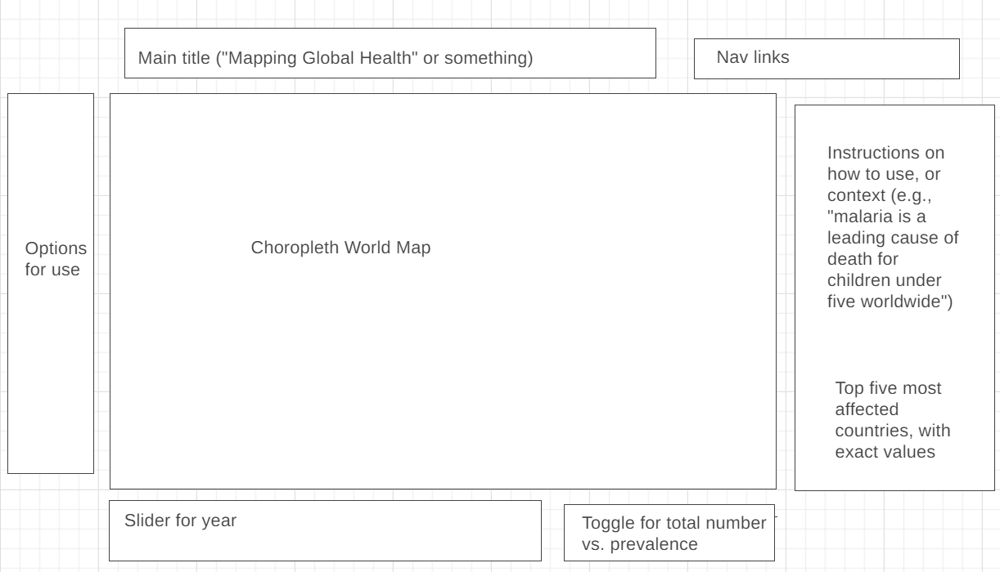

# JavaScript Project: Mapping Global Health

While rich countries around the world have largely eliminated malaria and tuberculosis as public health threats, they continue to be major killers worldwide.  This project will let users visualize the disease burden from the "Big Three" infectious diseases (malaria, tuberculosis, HIV), as well as select neglected tropical diseases (trachoma, polio, and guinea worm).  Users will be able to compare different countries and see how these have changed over time.

This will be based on data from the WHO's GHO OData API and made using D3.js.

## Core features -- users will be able to:

- Look at the incidence and death rate of worldwide diseases including malaria, tuberculosis, HIV/AIDS, trachoma, polio, and guinea wor
- See how these maps have shifted over time
- Choose between rates of disease cases/deaths and absolute numbers
- Compare disease burden with extreme poverty statistics (people living on ~$2/day)

### In addition, this project will include (if time permits):

- Buttons to toggle the language between English, Spanish, and French
- Filter using other criteria (e.g., death rate *under-5* for malaria, tuberculosis death with/without HIV)
- Geolocated data for wild polio and guinea worm cases (there are under 100 worldwide per year)

## Rough mockup

## Implementation Timeline:

- Thursday: Get project approved, outline project and familiarize myself with technologies and databases.
- Friday: Create HTML webpage.  Generate and display map by hardcoding what data I want to use to color map (e.g., malaria deaths in 2019).
- Saturday: Write a program that lets me switch between different maps (including total number and rates).  Create a dropdown menu or buttons to select map.
- Sunday: Add option to select a specific year (slider?  dropdown?).  Create a play button that show the chart from year to year.
- Monday: Make sure everything runs without bugs.  Create the rest of user interface and make it pretty.
- Tuesday: Fill out the rest of the website: instructions/context, country names pop up when your mouse hovers over country, bar charts for "top five countries" (in absolute number of e.g., malaria deaths).
- Wednesday: Bonus features or fixing/finishing core components; make things prettier with CSS.
- Thursday: checklist of everything: links, favicon, no errors, etc.  Deploy to Github.